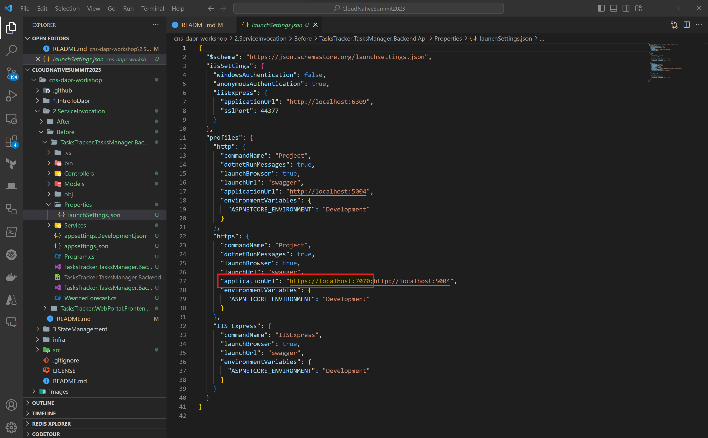
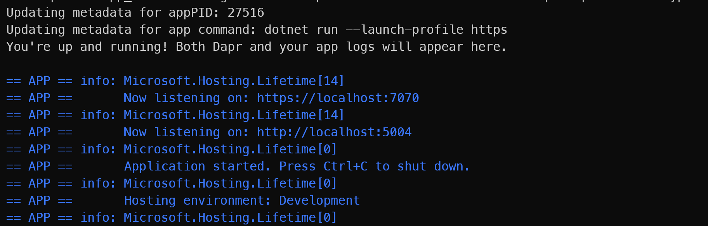
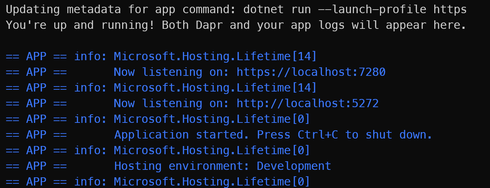

# Working with Service Invocation

In this module, we'll start integrating Dapr into both of our services and see how Dapr simplifies communication between microservices using Service Invocation.

This module introduces our application *TaskManager*. This is a basic application that demonstrates a tasks management application that follows the microservices architecturw. In this workshop, we will work with 3 microservices:

- **TasksTracker.WebPortal.Frontend.Ui** is a simple ASP.NET Razor pages web app that accepts requests from public users to manage their tasks. It invokes the component "ACA WebAPI-Backend" endpoints via HTTP or gRPC.
- **TasksTracker.TasksManager.Backend.Api** is a backend Web API which contains the business logic of tasks management service, data storage, and publishing messages to Azure Service Bus Topic.
- **TasksTracker.Processor.Backend.Svc** is an event-driven backend processor which is responsible for sending emails to task owners based on messages coming from Azure Service Bus Topic. Here there is a continuously running background processor, which is based on Dapr Cron timer configuration, to flag overdue tasks.

As we work through the workshop, we'll be adding various Azure resources to support different Dapr components.

## How Service Invocation works

Calling between services in distributed applications can be a challenge. Some of these challenges include:

* Where the other services are location.
* How to call other services securely, given the service address
* How to handle retries when short-lived transient errors occur.
* Capturing insights across service calls (Critical to debugging issues in Production!)

Dapr addresses these challenges by providing a service invocation API that acts as a reverse proxy with built-in service discovery, while also benefiting from built-in distributed tracing, metrics, error handling, encryption etc.

Let's use an example. Say we have two services, "Service A" and "Service B". Service A needs to call the ```catalog/items``` API on Service B. While we could make a direct call to it, we instead use the Service Invocation API on the Dapr sidecar like so:


Let's break this down:

1. Service A makes a call to the ```catalog/items``` endpoint in Service B by invoking the service invocation API on the Service A sidecar.
2. Service A sidecar forwards the request to the Service B sidecar.
3. The Service B sidecar makes the actual ```catalog/items``` request against the Service B API.
4. Service B executes the request and returns a response back to the sidecar.
5. Service B sidecar forwards the request back to Service A sidecar.
6. Service A sidecar returns the response back to Service A.

## Implementing Service invocation in our application.

Let's run our Backend API locally using Dapr. To do, you can open a new terminal and run the following command:

```powershell
dapr run --app-id tasksmanager-backend-api --app-port <web api application https port number found under properties->launchSettings.json. e.g. 7112> --dapr-http-port 3500 --app-ssl -- dotnet run --launch-profile https
```

Your HTTPS port may be a little different to what's shown here. To get your HTTPS port, you can find it in your ```lanchSettings.json``` file in your Backend API project:



Before we continue, let's break down the Dapr CLI command we just ran:

- *app-id*: The unique identifier of the application. Used for service discovery, state encapsulation, and the pub/sub consumer identifier.
- *app-port*: This parameter tells Dapr which port your application is listening on. You can get the app port from *properties->launchSettings.json* file in the Web API Project as shown in the image above. Make sure you use the https port listed within the *properties->launchSettings.json* as we are using the --app-ssl when running the dapr cli locally. Don't use the port inside the DockerFile. The DockerFile port will come in handy when you deploy to ACA at which point the application would be running inside a container.
- *dapr-http-port*: The HTTP port for Dapr to listen on.
- *app-ssl*: Sets the URI scheme of the app to https and attempts an SSL connection.

If everything is working, you should see the following output in your terminal where the app logs and Dapr logs will appear:



We can now test our Web API using the Dapr sidecar by issuing the following HTTP GET request:

```http
GET http://localhost:3500/v1.0/invoke/tasksmanager-backend-api/method/api/tasks?createdBy=willvelida@hotmail.co.uk
```

What happened here is that Dapr exposes its HTTP and gRPC APIs as a sidecar process which can access our Backend Web API. We didn't do any changes to the application code to include any Dapr runtime code. We also ensured separation of the application logic for improved supportability.

Looking at the HTTP GET request, we can break it as follows:

- */v1.0/invoke Endpoint*: is the Dapr feature identifier for the "Service to Service invocation" building block. This building block enables applications to communicate with each other through well-known endpoints in the form of http or gRPC messages. Dapr provides an endpoint that acts as a combination of a reverse proxy with built-in service discovery while leveraging built-in distributed tracing and error handling.
- *3500*: the HTTP port that Dapr is listening on.
- *tasksmanager-backend-api*: is the dapr application unique identifier.
- *method*: reserved word when using invoke endpoint.
- *api/tasks?createdBy=willvelida@hotmail.co.uk*: the path of the action method that needs to be invoked in the webapi service.

Now, we're going to conifgure our UI application to communicate with our Backend API using the Dapr SDK. The SDK offers us 3 ways of making remote service invocation calls:

1. Via HTTP using HttpClient.
2. Via HTTP using DaprClient
3. Via gRPC using DaprClient.

In this workshop, we'll use the DaprClient to invoke services via HTTP. We'll need to install the Dapr SDK in our UI application, which we can do by running the following command:

```dotnet
Install-Package Dapr.AspNetCore
```

Next, we'll need to add the following line in the ```Program.cs``` file of the UI app project and register the DaprClient as follows:

```csharp
var builder = WebApplication.CreateBuilder(args);

// Add services to the container.
builder.Services.AddRazorPages();
builder.Services.AddDaprClient();
// Rest of code removed for brevity
```

Now we need to inject the DaprClient into the ```.cshtml``` pages to use the ```InvokeMethodAsync``` method like so:

*Index.cshtml.cs*

```csharp
using Dapr.Client;
using Microsoft.AspNetCore.Mvc;
using Microsoft.AspNetCore.Mvc.RazorPages;
using TasksTracker.WebPortal.Frontend.Ui.Pages.Tasks.Models;

namespace TasksTracker.WebPortal.Frontend.Ui.Pages.Tasks
{
    public class IndexModel : PageModel
    {
        private readonly IHttpClientFactory _httpClientFactory;
        private readonly DaprClient _daprClient;

        public List<TaskModel>? TasksList { get; set; }

        [BindProperty]
        public string? TasksCreatedBy { get; set; }

        public IndexModel(IHttpClientFactory httpClientFactory, DaprClient daprClient)
        {
            _httpClientFactory = httpClientFactory;
            _daprClient = daprClient;
        }

        public async Task OnGetAsync()
        {
            TasksCreatedBy = Request.Cookies["TasksCreatedByCookie"];
            // direct svc to svc http request
            //var httpClient = _httpClientFactory.CreateClient("BackEndApiExternal");
            //TasksList = await httpClient.GetFromJsonAsync<List<TaskModel>>($"api/tasks?createdBy={TasksCreatedBy}");

            // Invoke via DaprSDK (Invoke HTTP services using DaprClient)
            TasksList = await _daprClient.InvokeMethodAsync<List<TaskModel>>(HttpMethod.Get, "tasksmanager-backend-api", $"api/tasks?createdBy={TasksCreatedBy}");
        }

        public async Task<IActionResult> OnPostDeleteAsync(Guid id)
        {
            // direct svc to svc http request
            //var httpClient = _httpClientFactory.CreateClient("BackEndApiExternal");
            //var result = await httpClient.DeleteAsync($"api/tasks/{id}");

            //Dapr SideCar Invocation
            await _daprClient.InvokeMethodAsync(HttpMethod.Delete, "tasksmanager-backend-api", $"api/tasks/{id}");

            return RedirectToPage();
        }

        public async Task<IActionResult> OnPostCompleteAsync(Guid id)
        {
            // direct svc to svc http request
            //var httpClient = _httpClientFactory.CreateClient("BackEndApiExternal");
            //var result = await httpClient.PutAsync($"api/tasks/{id}/markcomplete", null);

            //Dapr SideCar Invocation
            await _daprClient.InvokeMethodAsync(HttpMethod.Put, "tasksmanager-backend-api", $"api/tasks/{id}/markcomplete");

            return RedirectToPage();
        }
    }
}
```

*Create.cshtml.cs*

```csharp
using Dapr.Client;
using Microsoft.AspNetCore.Mvc;
using Microsoft.AspNetCore.Mvc.RazorPages;
using TasksTracker.WebPortal.Frontend.Ui.Pages.Tasks.Models;

namespace TasksTracker.WebPortal.Frontend.Ui.Pages.Tasks
{
    public class CreateModel : PageModel
    {
        private readonly IHttpClientFactory _httpClientFactory;
        private readonly DaprClient _daprClient;

        public CreateModel(IHttpClientFactory httpClientFactory, DaprClient daprClient)
        {
            _httpClientFactory = httpClientFactory;
            _daprClient = daprClient;
        }

        public IActionResult OnGet()
        {
            return Page();
        }

        [BindProperty]
        public TaskAddModel TaskAdd { get; set; }

        public async Task<IActionResult> OnPostAsync()
        {
            if (!ModelState.IsValid)
            {
                return Page();
            }

            if (TaskAdd != null)
            {
                var createdBy = Request.Cookies["TasksCreatedByCookie"];

                TaskAdd.TaskCreatedBy = createdBy;

                // direct svc to svc http request
                //var httpClient = _httpClientFactory.CreateClient("BackEndApiExternal");
                //var result = await httpClient.PostAsJsonAsync("api/tasks/", TaskAdd);

                // Using the Dapr Sidecar Invocation
                await _daprClient.InvokeMethodAsync(
                    HttpMethod.Post,
                    "tasksmanager-backend-api",
                    $"api/tasks",
                    TaskAdd);

            }
            return RedirectToPage("./Index");
        }
    }
}
```

*Edit.cshtml.cs*

```csharp
using Dapr.Client;
using Microsoft.AspNetCore.Mvc;
using Microsoft.AspNetCore.Mvc.RazorPages;
using TasksTracker.WebPortal.Frontend.Ui.Pages.Tasks.Models;

namespace TasksTracker.WebPortal.Frontend.Ui.Pages.Tasks
{
    public class EditModel : PageModel
    {
        private readonly IHttpClientFactory _httpClientFactory;
        private readonly DaprClient _daprClient;

        [BindProperty]
        public TaskUpdateModel? TaskUpdate { get; set; }

        public EditModel(IHttpClientFactory httpClientFactory, DaprClient daprClient)
        {
            _httpClientFactory = httpClientFactory;
            _daprClient = daprClient;
        }

        public async Task<IActionResult> OnGetAsync(Guid? id)
        {
            if (id == null)
            {
                return NotFound();
            }

            // direct svc to svc http request
            //var httpClient = _httpClientFactory.CreateClient("BackEndApiExternal");
            //var Task = await httpClient.GetFromJsonAsync<TaskModel>($"api/tasks/{id}");

            //Dapr SideCar Invocation
            var Task = await _daprClient.InvokeMethodAsync<TaskModel>(HttpMethod.Get, "tasksmanager-backend-api", $"api/tasks/{id}");

            if (Task == null)
            {
                return NotFound();
            }

            TaskUpdate = new TaskUpdateModel()
            {
                TaskId = Task.TaskId,
                TaskName = Task.TaskName,
                TaskAssignedTo = Task.TaskAssignedTo,
                TaskDueDate = Task.TaskDueDate,
            };

            return Page();
        }

        public async Task<IActionResult> OnPostAsync()
        {
            if (!ModelState.IsValid)
            {
                return Page();
            }

            if (TaskUpdate != null)
            {
                // direct svc to svc http request
                //var httpClient = _httpClientFactory.CreateClient("BackEndApiExternal");
                //var result = await httpClient.PutAsJsonAsync($"api/tasks/{TaskUpdate.TaskId}", TaskUpdate);

                //Dapr SideCar Invocation
                await _daprClient.InvokeMethodAsync<TaskUpdateModel>(HttpMethod.Put, "tasksmanager-backend-api", $"api/tasks/{TaskUpdate.TaskId}", TaskUpdate);
            }

            return RedirectToPage("./Index");
        }
    }
}
```

Let's run our UI app locally so we can test that we can invoke services via the Dapr sidecar. To do so, run the following command in the UI project directory:

```powershell
dapr run --app-id tasksmanager-frontend-webapp --app-port <web frontend application https port found under properties->launchSettings.json. e.g. 7000> --dapr-http-port 3501 --app-ssl -- dotnet run --launch-profile https
```

*The Backend API needs to be running as well, so if you stopped it, make sure you run the command you did earlier for your API project before running it for the UI project.*

Confirm that you can see the following logs in your terminal:



Now both applications are running using the Dapr sidecar! Navigate to ```https://localhost:{localwebport}``` and provide the email in your ```FakeTasksManager.cs``` file. If the app is working, you should see a tasks list associated with that email.

That ends this module! Next up, we'll talk about [State Management](../3.StateManagement/README.md).