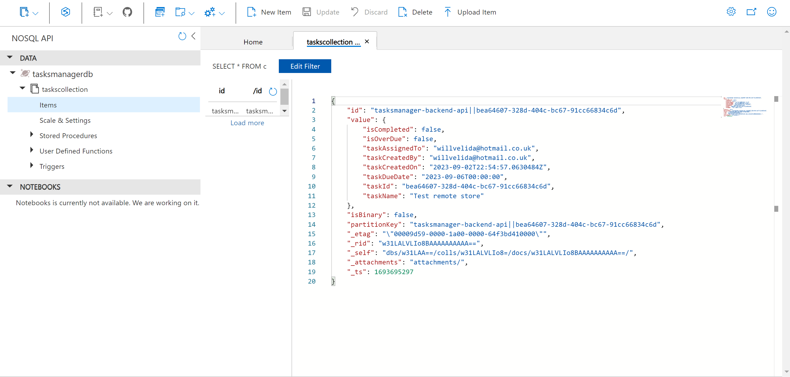

# Working with State Management

Distributed apps are composed of independent services. In a ideal world, each service should be stateless, but there will be some services that need to track state to complete certain operations.

For example, say if we have an e-commerce application using a shopping basket service. If we couldn't track state, customers would lose the shopping basket each time they leave the application. For these situations, we need to have state persisted to a distributed state store.

The Dapr state management building block simplifies the way we track state in our application. In this module, we'll add State Management capabiliites to our TaskTracker application, so we can persist our tasks remotely rather than locally.

Let's start this module with an overview of how State Management works and what challenges it solves.

## How State Management works

Tracking state in distributed applications can be challenge for a couple of reasons:

- The application may require different types of data stores.
- Different consistency levels for accessing and updating data may be required.
- Multiple users may update data at the same time, requiring conflict resolution.
- Services will need to retry any transient errors that occur while interacting with the data store.

Dapr state management offers a key/value API, which our application interacts with to store and retrieve key/value data. The Dapr sidecar consumes a defined state store component to persist data. As developers, we have a wide variety of different [supported state stores](https://docs.dapr.io/operations/components/setup-state-store/supported-state-stores/) that we can use.

The State Management API can be called with either HTTP or gRPC. For example:

```http
GET http://localhost:<dapr-port>/v1.0/state/<store-name>
```

- **dapr-port**: The HTTP port that Dapr listens on.
- **store-name**: The name of the state store component to use.

Let's dive a bit deeper into this by using our shopping basket from before:


Let's break this down:

1. The basket service will call the state management API on the Dapr sidecar. The body of our requet is a JSON array that can contain multiple key/value pairs.
2. The sidecar determines which state store to use based on the component configuration. In this example, we're using Redis Cache.
3. The sidecar will persist our data to the Redis Cache.

Retreiving the data we stored is just another API call. So for this example, we can use the following:

```console
curl http://localhost:3500/v1.0/state/statestore/basket1
```

This command will return the stored state in the response body:

```json
{
  "items": [
    {
      "itemId": "DaprHoodie",
      "quantity": 1
    }
  ],
  "customerId": 1
}
```

## Implementing State Management in our Application

Let's implement state management into our application. We'll start off using State Management locally using Redis. We'll then provision a Azure Cosmos DB account, create a state store component for our application and then configure our application to use it.

Dapr integrates with existing databases to provide apps with state management for CRUD operations, transactions and more. A state store in Dapr is described using a Component file like so:

```yaml
apiVersion: dapr.io/v1alpha1
kind: Component
metadata:
  name: statestore
spec:
  type: state.redis
  version: v1
  metadata:
  - name: redisHost
    value: localhost:6379
  - name: redisPassword
    value: ""
  - name: actorStateStore
    value: "true"
```

The type of database of database is determined by the ```type``` field. Things like connection strings and other metadata are put in the ```metadata``` section. 

When you install Dapr, you will have a Redis state store defined for you in the ```%USERPROFILE%\.dapr\components``` folder called ```statestore.yaml```. This is the local Redis cache that we will use in this module.

*For Visual Studio Code users*, there is an extension called [Redis Xplorer](https://marketplace.visualstudio.com/items?itemName=davidsekar.redis-xplorer) that we will use to visually explorer the data that we will store.

Once the extension is installed, we can add a new profile to work with our local Redis Cluster. The extension will add a new tab in the explorer section of VS Code called "REDIS XPLORER". Click on the + sign, enter a nickname for your cache (localhost, or dapr_redis), as well as the hostname and the port.

You can get this information by running the following command:

```console
docker ps
```

The output should look like this:

```console
CONTAINER ID   IMAGE                      COMMAND                  CREATED        STATUS                 PORTS                              NAMES
22693c04ff0c   redis:6                    "docker-entrypoint.s…"   2 months ago   Up 3 hours             0.0.0.0:6379->6379/tcp             dapr_redis
```

We'll need to add the Dapr Client SDK to the Backend API to get this working. To do so, we can run the following command in our API project:

```dotnet
Install-Package Dapr.AspNetCore
```

Once we've installed that, we can create a new class that will manage task persistence. Add a file under the **Services** folder called *TasksStoreManager.cs* which will implement the *ITasksManager* interface.

```csharp
using Dapr.Client;
using TasksTracker.TasksManager.Backend.Api.Models;

namespace TasksTracker.TasksManager.Backend.Api.Services
{
    public class TasksStoreManager : ITasksManager
    {
        private static string STORE_NAME = "statestore";
        private readonly DaprClient _daprClient;
        private readonly IConfiguration _config;
        private readonly ILogger<TasksStoreManager> _logger;

        public TasksStoreManager(DaprClient daprClient, IConfiguration config, ILogger<TasksStoreManager> logger)
        {
            _daprClient = daprClient;
            _config = config;
            _logger = logger;
        }
        public async Task<Guid> CreateNewTask(string taskName, string createdBy, string assignedTo, DateTime dueDate)
        {
            var taskModel = new TaskModel()
            {
                TaskId = Guid.NewGuid(),
                TaskName = taskName,
                TaskCreatedBy = createdBy,
                TaskCreatedOn = DateTime.UtcNow,
                TaskDueDate = dueDate,
                TaskAssignedTo = assignedTo,
            };

            _logger.LogInformation("Save a new task with name: '{0}' to state store", taskModel.TaskName);
            await _daprClient.SaveStateAsync<TaskModel>(STORE_NAME, taskModel.TaskId.ToString(), taskModel);
            return taskModel.TaskId;
        }

        public async Task<bool> DeleteTask(Guid taskId)
        {
            _logger.LogInformation("Delete task with Id: '{0}'", taskId);
            await _daprClient.DeleteStateAsync(STORE_NAME, taskId.ToString());
            return true;
        }

        public async Task<TaskModel?> GetTaskById(Guid taskId)
        {
            _logger.LogInformation("Getting task with Id: '{0}'", taskId);
            var taskModel = await _daprClient.GetStateAsync<TaskModel>(STORE_NAME, taskId.ToString());
            return taskModel;
        }

        public async Task<List<TaskModel>> GetTasksByCreator(string createdBy)
        {
            var query = "{" +
                    "\"filter\": {" +
                        "\"EQ\": { \"taskCreatedBy\": \"" + createdBy + "\" }" +
                    "}}";

            var queryResponse = await _daprClient.QueryStateAsync<TaskModel>(STORE_NAME, query);

            var tasksList = queryResponse.Results.Select(q => q.Data).OrderByDescending(o=>o.TaskCreatedOn);
            return tasksList.ToList();
        }

        public async Task<bool> MarkTaskCompleted(Guid taskId)
        {
            _logger.LogInformation("Mark task with Id: '{0}' as completed", taskId);
            var taskModel = await _daprClient.GetStateAsync<TaskModel>(STORE_NAME, taskId.ToString());
            if (taskModel != null)
            {
                taskModel.IsCompleted = true;
                await _daprClient.SaveStateAsync<TaskModel>(STORE_NAME, taskModel.TaskId.ToString(), taskModel);
                return true;
            }
            return false;
        }

        public async Task<bool> UpdateTask(Guid taskId, string taskName, string assignedTo, DateTime dueDate)
        {
            _logger.LogInformation("Update task with Id: '{0}'", taskId);
            var taskModel = await _daprClient.GetStateAsync<TaskModel>(STORE_NAME, taskId.ToString());
            var currentAssignee = taskModel.TaskAssignedTo;
            if (taskModel != null)
            {
                taskModel.TaskName = taskName;
                taskModel.TaskAssignedTo = assignedTo;
                taskModel.TaskDueDate = dueDate;
                await _daprClient.SaveStateAsync<TaskModel>(STORE_NAME, taskModel.TaskId.ToString(), taskModel);
                return true;
            }
            return false;
        }
    }
}
```

Here, we have injected the ```DaprClient``` into the new service and that it has several methods that support CRUD operations. We also have a variable called ```statestore``` which should match the name in the component file.

One thing to note here is that the query API will not work against the local Redis store. This will need RediSearch locally on your machine, which is out of scope. We'll test the query API once we switch the Cosmos DB.

We'll need to register the service we just created as well as the DaprClient to our Backend API. To do so, add the following two lines to our ```Program.cs``` file in the Backend API:

```csharp
using TasksTracker.TasksManager.Backend.Api.Services;

var builder = WebApplication.CreateBuilder(args);

// Add services to the container.
builder.Services.AddDaprClient();
builder.Services.AddSingleton<ITasksManager, TasksStoreManager>();
// Code removed for brevity
```

Have a go at creating new tasks, updating them, deleting them etc. You can do this with Postman, curl or any other tool. If you run the application, you'll get an error running the query against the local redis cache. 

To see the application in all its glory, let's set up Cosmos DB and use it as our state store.

### Using Cosmos DB as our state store.

For this module, we'll need to create Cosmos DB resources so we can store state from our application. Let's start by creating a resource group in Azure. A resource group is a logical container into which Azure resources, like Cosmos DB accounts, are deployed and managed. We can create a resource group by running the following AZ CLI command:

```powershell
$LOCATION="<azure-region-near-you>"
$RG_NAME="<resource-group-name>"

az group create --name $RG_NAME --location $LOCATION
```

Pick a location nearest to your location to minimize latency. I'm based in Australia, so I'll pick *australiaeast*. Once our resource group is created, we can start creating our Cosmos DB resources by running the following commands. Replace the placeholders with your own values:

```powershell
$COSMOS_DB_ACCOUNT="<choose a unique cosmos db account name e.g. taskstracker-state-store-your initials here>" `
$COSMOS_DB_DBNAME="tasksmanagerdb" `
$COSMOS_DB_CONTAINER="taskscollection" 

## Check if Cosmos account name already exists globally
az cosmosdb check-name-exists `
--name $COSMOS_DB_ACCOUNT

## if it returns false continue with the next command 
## else try a new unique name

## Create a Cosmos account for SQL API
az cosmosdb create `
--name $COSMOS_DB_ACCOUNT `
--resource-group $RG_NAME

## Create a SQL API database
az cosmosdb sql database create `
--account-name $COSMOS_DB_ACCOUNT `
--resource-group $RG_NAME `
--name $COSMOS_DB_DBNAME

## Create a SQL API container
az cosmosdb sql container create `
--account-name $COSMOS_DB_ACCOUNT `
--resource-group $RG_NAME `
--database-name $COSMOS_DB_DBNAME `
--name $COSMOS_DB_CONTAINER `
--partition-key-path "/id" `
--throughput 400
```

Once the resources are created, we'll need the ```primaryMasterKey``` of the Cosmos DB account. We can retrieve that by running the following command:

```powershell
## List Azure CosmosDB keys
az cosmosdb keys list `
--name $COSMOS_DB_ACCOUNT `
--resource-group $RG_NAME
```

Copy the value of this as we'll need it for the next step.

### Configuring our State Store file.

Dapr uses a modular design where functionality is delivered as a component. Each component has a interface definition, and all components are pluggable so you can swap out one component for another, without changing your application code.

Components are configured at design-time with a YAML file which is stored in either a components/local folder within your solution, or globally in the ```.dapr``` folder created when invoking ```dapr init```.

Each component spec value (specifically the ```metadata``` section), can change between components of the same component type. I recommend that you check out [the differences between state store definitions](https://docs.dapr.io/reference/components-reference/) before using them. 

This module uses Cosmos DB, so we'll just focus on creating a state store specificaiton for now.

In our project directory (one level above our API and UI project folders), create a new folder called **components** and add a new yaml file called **dapr-statestore-cosmos.yaml**. This will define our state store component:

```yaml
apiVersion: dapr.io/v1alpha1
kind: Component
metadata:
  name: statestore
spec:
  type: state.azure.cosmosdb
  version: v1
  metadata:
    - name: url
      value: <value>
    - name: masterKey
      value: "<value>"
    - name: database
      value: tasksmanagerdb
    - name: collection
      value: taskscollection
scopes:
  - tasksmanager-backend-api
```

Let's break this down:

- We've used the name ```statestore``` which should match the name of statestore we've used in the ```TaskStoreManager.cs``` file. As well, we have set the metadata key/value to allow us to connect to Azure Cosmos DB.
- We've updated the other metadata keys such as ```database```, ```collection```, etc... to match the values of your Cosmos DB instance. For full metadata specs, you can check this page.
- By default, all dapr-enabled container apps within the same environment will load the full set of deployed components. By adding ```scopes``` to a component, you tell the Dapr sidecars for each respective container app which components to load at runtime. Using scopes is recommended for production workloads. In our case, we have set the scopes to ```tasksmanager-backend-api``` which represents the dapr-app-id which is associated to the container app that needs access to Azure Cosmos DB State Store as this will be the application that needs access to Azure Cosmos DB State Store.

Now that we've configured our state store component, we can test it! Run the following Dapr CLI command:

```console
dapr run --app-id tasksmanager-backend-api --app-port 7070 --dapr-http-port 3500 --app-ssl --resources-path ..\components\ -- dotnet run --launch-profile https
```

In this command, we add the ```--resource-path``` flag to specify where we want to load our components from. Since we created a new folder for this exercise, we want to point it to this folder so we can use our configured Dapr State Store.

Run the UI application and enter a email to view your tasks. You should see the following screen:


Where did all our tasks go?! Well since we haven't saved anything in our state store yet, there won't be any! You can test creating some tasks, and they should appear in the UI like so:


If you look into your Cosmso DB account, you should see the task that you just created!



Feel free to play around with State Management a bit more. Add more tasks, delete some, mark some as complete etc. For now, we have a Dapr application that uses the State Managment Building block to save state in our application.

[In the next section](../4.Pub-Sub/README.md), we'll talk about Dapr Pub/Sub and how we can use to to publish messages to Azure Service Bus when a new task is saved.